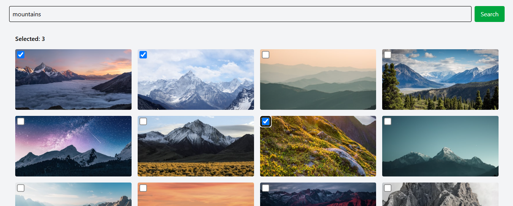
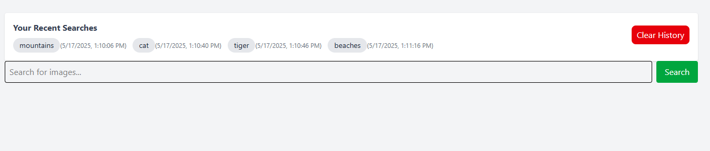

# MERN + OAuth Project

This project is a MERN stack application that allows users to log in via OAuth (Google, GitHub, Facebook), search for images using the Unsplash API, track their search history, and select multiple images with a dynamic counter.

---

## 🚀 Setup Instructions

### 🛠 Prerequisites

- Node.js & npm
- MongoDB Atlas
- Unsplash developer account
- OAuth credentials for Google, GitHub, and Facebook

### 📁 Folder Structure

```
MERN + OAuth Project/
├── client/               # React frontend
│   ├── public/
│   ├── src/
│   │   ├── components/   # TopSearches, SearchHistory, ImageGrid, etc.
│   │   └── App.jsx
│   └── package.json
│
├── server/               # Express backend
│   ├── config/           # passport.js
│   ├── models/           # User.js, Search.js, TopSearch.js
│   ├── routes/           # authRoutes.js, searchRoutes.js
│   ├── middlewares/      # verifyToken.js
│   ├── server.js
│   └── package.json
│
└── README.md
```

### ⚙️ Environment Variables

Create `.env` files `server/`

#### `.env` (server)

```
PORT=5000
MONGO_URI=your_mongodb_connection_string
JWT_SECRET=your_jwt_secret
CLIENT_URL=http://localhost:5173

# OAuth
GOOGLE_CLIENT_ID=your_google_client_id
GOOGLE_CLIENT_SECRET=your_google_client_secret

GITHUB_CLIENT_ID=your_github_client_id
GITHUB_CLIENT_SECRET=your_github_client_secret

FACEBOOK_APP_ID=your_facebook_app_id
FACEBOOK_APP_SECRET=your_facebook_app_secret

# Unsplash
UNSPLASH_ACCESS_KEY=your_unsplash_access_key
```

---

## API Testing

### OAuth Authentication

Handled via browser redirect, not cURL. Routes:

```
GET /auth/google
GET /auth/github
GET /auth/facebook
```

### POST /api/search

Search for images on Unsplash

```bash
curl -X POST http://localhost:5000/api/search \
-H "Authorization: Bearer <JWT_TOKEN>" \
-H "Content-Type: application/json" \
-d '{ "term": "mountains" }'
```

### GET /api/history

Get user's recent search history

```bash
curl -X GET http://localhost:5000/api/history \
-H "Authorization: Bearer <JWT_TOKEN>"
```

### GET /api/top-searches

Get most frequent search terms globally

```bash
curl -X GET http://localhost:5000/api/top-searches
```

### GET /api/test-protected

Test protected route

```bash
curl -X GET http://localhost:5000/api/test-protected \
-H "Authorization: Bearer <JWT_TOKEN>"
```

---

## Visual Proof Checklist

- [x] OAuth login (Google/GitHub/Facebook)
      

- [x] Search with image grid & multi-select counter
      

- [x] Search history with timestamps
      

## Credits

- Built by \[Your Name] as part of the UD Studios Full Stack Internship assignment.
- Uses Unsplash API for fetching images.
- Authentication via Passport.js OAuth.
